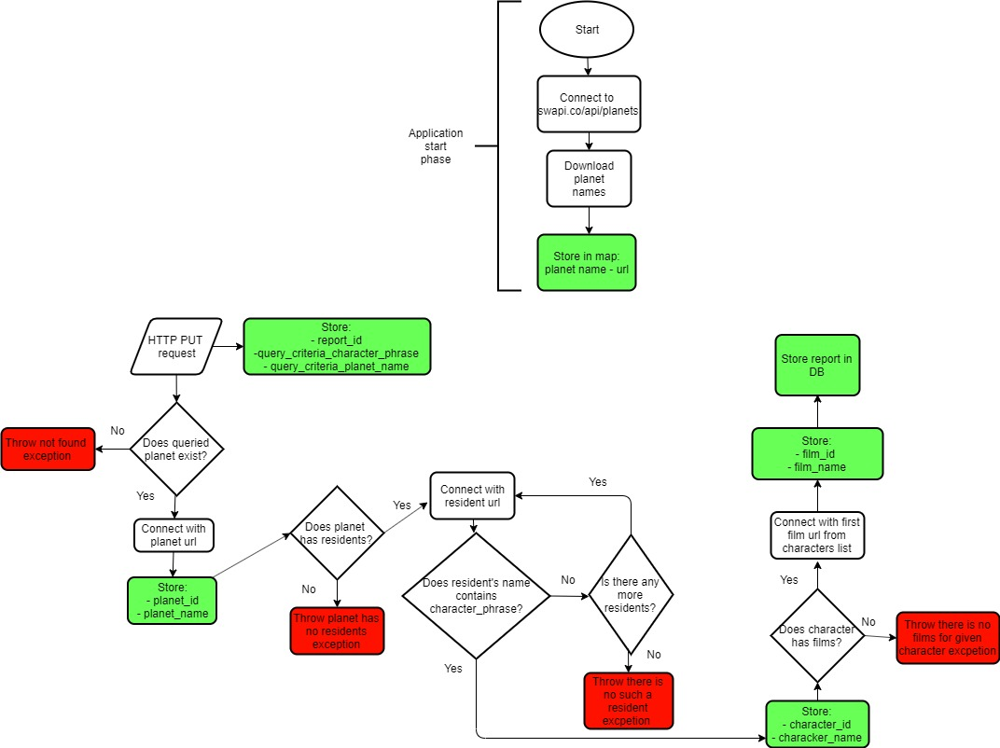

# Star Wars Report Generator API [](https://circleci.com/gh/WojciechWeg/Star-Wars-Report-Generator-API)

Purpose of this project was to implement an REST API that creates a report 
for given input. 

### PUT on /report/{report_id} 
- generates report of report_id and saves it in database
table.
- If report of given report_id does not exist, then new report is created and
stored in database. Otherwise, existing report is updated.
- PUT request body JSON - query criteria:

`curl "http://localhost:8080/report/4" -i -X PUT -H "Content-Type: application/json" -d "{"query_criteria_character_phrase": "bot","query_criteria_planet_name": "Bespin"}"`
```
{
“query_criteria_character_phrase”: “CHARACTER_PHRASE”,
“query_criteria_planet_name”: “PLANET_NAME”
}
```

### DELETE on /report/{report_id}
- deletes report of report_id from database.

`curl "http://localhost:8080/report/1" -i -X DELETE`

### DELETE on /report
 - deletes all reports from database
 
 `curl "http://localhost:8080/report/" -i -X DELETE`

### GET on /report 
- returns all report data as JSON:

`curl "http://localhost:8080/report/" -i -X GET`


```
[{
“report_id”: “{report_id},
“query_criteria_character_phrase”: “CHARACTER_PHRASE”,
“query_criteria_planet_name”: “PLANET_NAME”,
“film_id”: “FILM_ID”,
“film_name”: “FILM_NAME”,
“character_id”: “CHARACTER_ID”,
“character_name”: “CHARACTER_NAME”,
“planet_id”: “PLANET_ID”,
“planet_name”: “PLANET_NAME”
},...]
```
### GET on /report/{report_id}
 - returns report_id data as JSON:
 
`curl "http://localhost:8080/report/" -i -X GET`

```
{
“report_id”: “{report_id},
“query_criteria_character_phrase”: “CHARACTER_PHRASE”,
“query_criteria_planet_name”: “PLANET_NAME”,
“film_id”: “FILM_ID”,
“film_name”: “FILM_NAME”,
“character_id”: “CHARACTER_ID”,
“character_name”: “CHARACTER_NAME”,
“planet_id”: “PLANET_ID”,
“planet_name”: “PLANET_NAME”
}
```

How report is generated?
The application takes query criteria and queries following services:
- https://swapi.co/api/films/
- https://swapi.co/api/people/
- https://swapi.co/api/planets/

to obtain list of films in which appeared characters who contains given
CHARACTER_PHRASE in their name and whose homeworld planet is PLANET_NAME.
The application queries API with user input and stores transformed result in database report
table. 

Report table columns:

`report_id, query_criteria_character_phrase,
query_criteria_planet_name, film_id, film_name, character_id,
character_name, planet_id, planet_name`

Flowchart shown below represents solution and how report is generated.




### How to run
To start the project locally use start.bat file.


Tools used:
- Java 1.8
- In mememory H2 database
- Project lombok
- JUnit 5
- GSON
- Spring boot starter JPA
- Spring boot starter web
